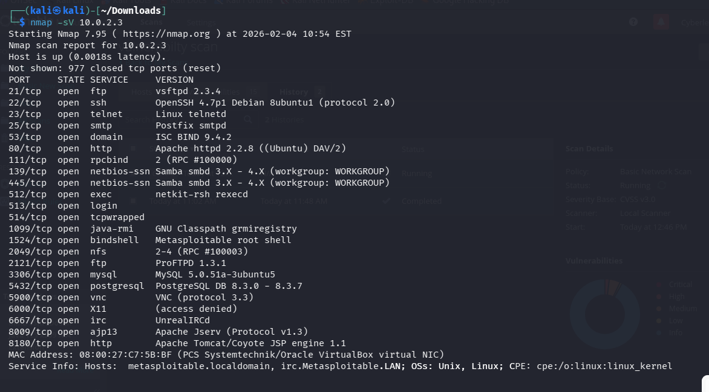
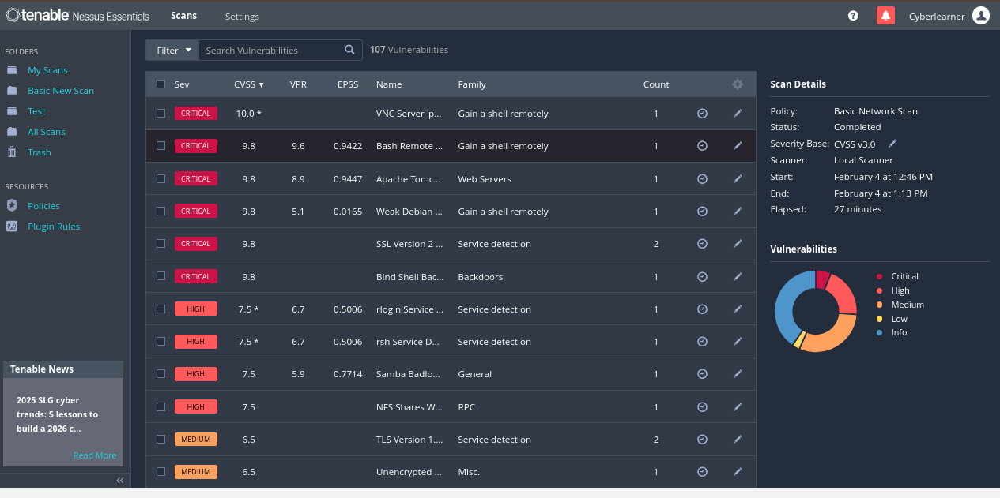
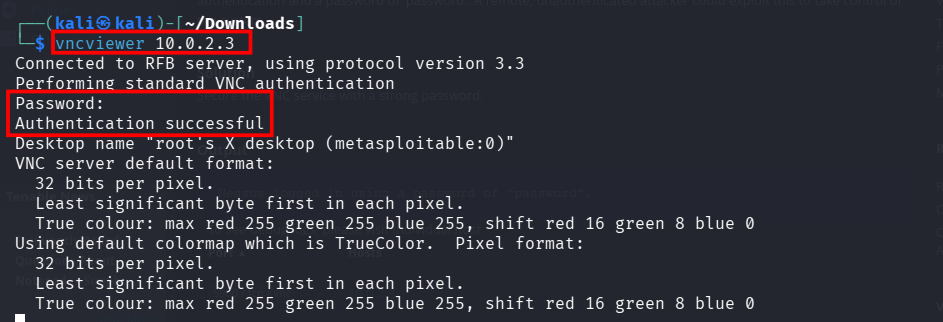
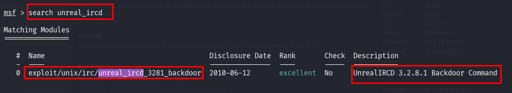
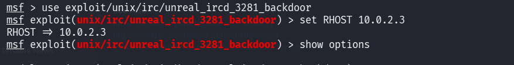
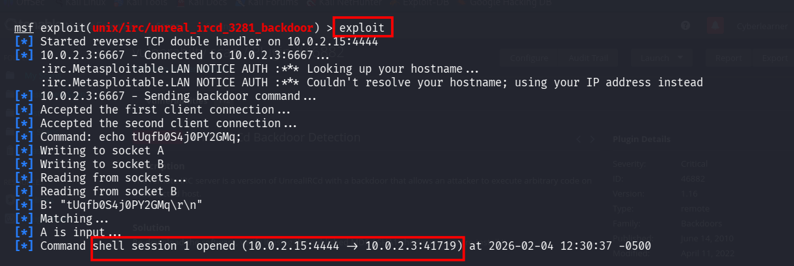
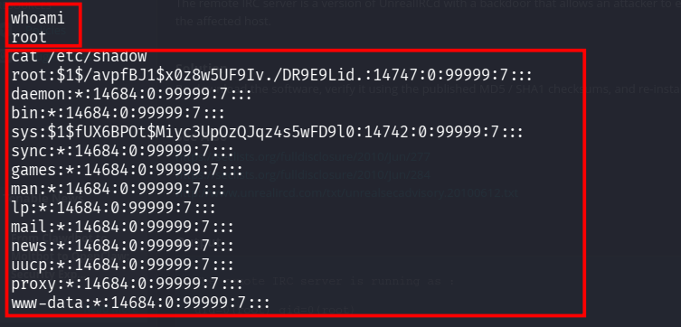
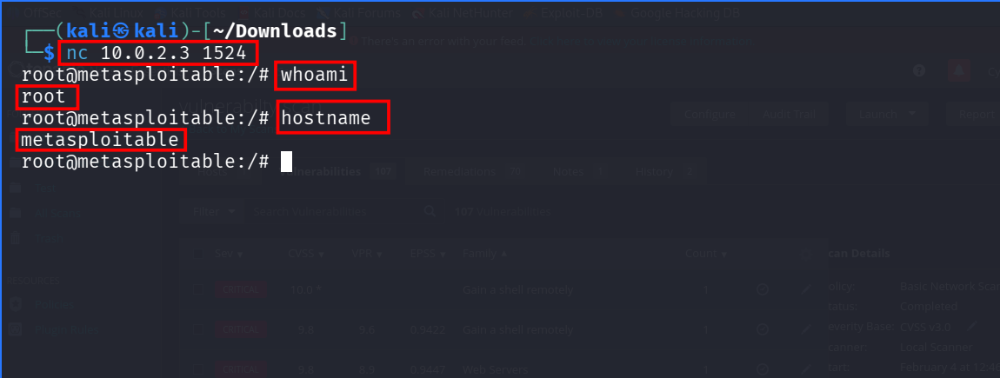
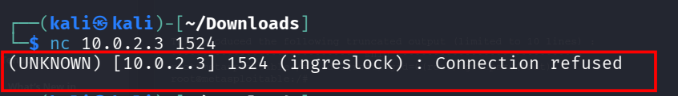

# Vulnerability Management Lifecycle: Metasploitable 2

## 📌 Project Overview
This project documents the execution of a complete **Vulnerability Management Lifecycle**. Using a home lab environment consisting of **Kali Linux** (Attacker) and **Metasploitable 2** (Target), I performed vulnerability assessment, prioritization, exploitation (validation), remediation, and final verification.

### 🎯 Objectives
- **Assess** the security posture of the target system using Nmap and Nessus.
- **Validate** findings by exploiting critical vulnerabilities.
- **Remediate** the identified issues by patching, configuration changes, or firewall rules.
- **Verify** the fixes to ensure the attack surface was reduced.

---

## 🛠️ Phase 1: Discovery & Assessment
The first phase involved scanning the target subnet to identify live hosts, open ports, and potential vulnerabilities.

### Step 1: Nmap Network Scanning
I utilized Nmap to identify open ports and service versions.
- **Command:** `nmap -sV 10.0.2.3`
- **Findings:** The scan revealed multiple critical ports, including Port 1524 (Bind Shell), Port 5900 (VNC), and Port 6667 (IRC).

*Figure 1: Initial Nmap scan showing open ports.*

### Step 2: Nessus Vulnerability Scanning
I performed a "Basic Network Scan" using Nessus Essentials.
- **Critical Findings:**
  - **VNC Server 'password' Password** (CVE-1999-0501) 
  - **UnrealIRCd Backdoor Detection** (CVE-2010-2075) 
  - **Bind Shell Backdoor Detection** 

*Figure 2: Nessus Dashboard highlighting Critical vulnerabilities.*

---

## 💥 Phase 2: Exploitation & Validation
To confirm the severity of the scan results, I attempted to exploit the identified vulnerabilities.

### 1. Exploiting VNC (Port 5900)
The scan indicated the VNC server used a weak default password.
- **Exploit:** Attempted login with `vncviewer`.
- **Command:** `vncviewer 10.0.2.3` -> Password: `password`
- **Result:** **Successful Authentication**.I gained remote desktop access to the target].

*Figure 3: Gaining access via VNC Viewer.*

### 2. Exploiting UnrealIRCd (Port 6667)
The `UnrealIRCd` service contained a malicious backdoor. I utilized the Metasploit Framework to identify, configure, and execute the exploit.

**Step 1: Searching for the Exploit**
I searched the Metasploit database to find the correct module for the UnrealIRCd backdoor.
- **Command:** `search unreal_ircd`
- **Module Found:** `exploit/unix/irc/unreal_ircd_3281_backdoor`

**Step 2: Configuring the Payload**
I selected the exploit and set the Target IP (`RHOST`) to the Metasploitable machine (`10.0.2.3`).
- **Command:** `use exploit/unix/irc/unreal_ircd_3281_backdoor`
- **Command:** `set RHOST 10.0.2.3`

**Step 3: Execution & Root Access**
I launched the exploit. The backdoor allowed command execution, instantly opening a shell session.
- **Command:** `exploit`
- **Result:** **Root Access**. I verified this by running `whoami`, which returned `root`.

### 3. Exploiting Bind Shell (Port 1524)
A root shell was listening on port 1524 (Ingreslock) with no authentication.
- **Exploit:** Netcat connection.
- **Command:** `nc 10.0.2.3 1524`
- **Result:** **Instant Root Access**. `whoami` returned `root`.

*Figure 5: Netcat connection dropping directly into a root shell.*

---

## 🛡️ Phase 3: Remediation
After validating the risks, I applied specific fixes to close the vulnerabilities.

### Remediation Table

| Vulnerability | Action Taken | Command Used |
| :--- | :--- | :--- |
| **UnrealIRCd** | Killed malicious process & Blocked port | `sudo kill -9 4666`   `sudo iptables -A INPUT -p tcp --dport 6667 -j DROP`  |
| **VNC Weak Password** | Changed password & Killed stale process | [cite_start]`vncpasswd` (set to strong password)   `sudo kill -9 4676` |
| **Bind Shell** | Stopped service & Edited Config | `sudo /etc/init.d/xinetd stop`   Edited `/etc/inetd.conf` to comment out `ingreslock`  |

*Figure 6: Executing remediation commands in the terminal.*

---

## ✅ Phase 4: Verification
The final phase was to verify that the remediations were effective and no new issues were introduced.

### Verification 1: Bind Shell
Attempted to reconnect to port 1524 using Netcat.
- **Command:** `nc 10.0.2.3 1524`
- **Result:** `(UNKNOWN) [10.0.2.3] 1524 (ingreslock) : Connection refused`.

### Verification 2: VNC
Attempted to reconnect using the old weak password.
- **Command:** `vncviewer 10.0.2.3`
- **Result:** `Authentication failure`.

### Verification 3: Final Scans
- **Nmap:** Port 6667 is now listed as `filtered`, and Port 1524 is closed/refused.
- **Nessus:** The specific Critical vulnerabilities for IRC, VNC, and Bind Shell were resolved in the remediation scan.

*Figure 7: Connection refused, confirming the backdoor is closed.*

---

## 📝 Conclusion
This lab successfully demonstrated the full vulnerability management lifecycle. By identifying critical exploits in a legacy system and applying targeted hardening measures, the system's attack surface was significantly reduced.
